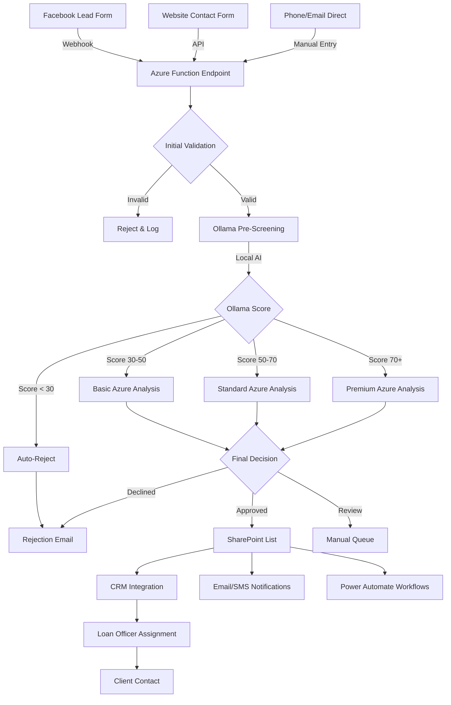

# Mortgage Lead Lifecycle with Ollama Integration

## Lead Flow Architecture



## Detailed Lead Lifecycle

### 1. Lead Sources (Entry Points)
- **Facebook Lead Ads** → Webhook → Your Azure Function
- **Website Forms** → Direct API call → Your Azure Function  
- **Phone/Email** → Manual entry → SharePoint/CRM → Triggers Azure Function
- **Partner Referrals** → API integration → Your Azure Function

### 2. Initial Reception (Azure Function)
```csharp
// ProcessMortgageLeadWithOllama.cs receives lead
{
    "name": "John Smith",
    "email": "john@example.com", 
    "phone": "555-1234",
    "creditScore": "700-750",
    "income": 95000,
    "source": "Facebook"
}
```

### 3. Ollama Pre-Screening (Local, Fast, Free)
```javascript
// ollama-lead-bridge.js processes locally
POST http://localhost:3456/prequalify

// Ollama (Llama 3.2:3b) analyzes:
- Credit worthiness
- Income stability  
- Down payment adequacy
- Employment verification
- Risk factors

// Returns in ~6 seconds:
{
    "score": 75,
    "confidence": 85,
    "recommendation": "APPROVE",
    "factors": {...}
}
```

### 4. Intelligent Routing Based on Ollama Score

#### Path A: Low Quality (Score < 30)
- **Action**: Immediate rejection
- **Ollama Only**: No Azure API costs
- **Notification**: Polite rejection email
- **Logging**: Track for analytics
- **Time**: < 10 seconds total

#### Path B: Borderline (Score 30-50)  
- **Action**: Basic Azure OpenAI analysis
- **Cost**: Minimal API usage (~$0.02)
- **Analysis**: Quick verification
- **Decision**: Usually manual review
- **Time**: ~20 seconds total

#### Path C: Qualified (Score 50-70)
- **Action**: Standard Azure OpenAI analysis
- **Cost**: Moderate API usage (~$0.05)
- **Analysis**: Full qualification check
- **Decision**: Auto-approve or review
- **Time**: ~30 seconds total

#### Path D: Premium (Score 70+)
- **Action**: Comprehensive Azure OpenAI analysis
- **Cost**: Full API usage (~$0.10)
- **Analysis**: Detailed with product recommendations
- **Decision**: Fast-track approval
- **Priority**: HIGH - Immediate notification
- **Time**: ~45 seconds total

### 5. Azure OpenAI Enhancement
```csharp
// Only for scores >= 30
Azure OpenAI provides:
- Loan product recommendations
- Interest rate estimates
- Required documentation list
- Risk assessment
- Compliance checks
```

### 6. Data Storage & Distribution

#### SharePoint List
```json
{
    "LeadID": "2024-001234",
    "Name": "John Smith",
    "OllamaScore": 75,
    "AzureScore": 82,
    "FinalScore": 79.5,
    "Priority": "HIGH",
    "AssignedTo": "LoanOfficer1",
    "Status": "InProgress"
}
```

#### Notifications Triggered
- **Email**: Loan officer gets detailed lead info
- **SMS**: High-priority alert for 70+ scores
- **Teams**: Channel notification for team
- **CRM**: Auto-creates opportunity

### 7. Power Automate Workflows
```yaml
Trigger: New SharePoint item
Conditions:
  - If FinalScore > 70: Send immediate SMS
  - If FinalScore > 50: Create CRM opportunity  
  - If FinalScore < 30: Send rejection template
Actions:
  - Assign to available loan officer
  - Schedule follow-up tasks
  - Start document collection
```

### 8. Loan Officer Engagement
1. Receives prioritized lead
2. Reviews AI recommendations
3. Contacts client within:
   - HIGH: 1 hour
   - MEDIUM: 4 hours  
   - LOW: 24 hours
4. Updates CRM status
5. Begins application process

## Cost Comparison

### Without Ollama (Previous System)
- Every lead → Azure OpenAI: $0.10/lead
- 1000 leads/month = $100
- Many low-quality leads analyzed

### With Ollama (Current System)
- All leads → Ollama: $0 (local)
- ~30% rejected locally: 0 Azure cost
- ~70% to Azure: $0.02-0.10 each
- 1000 leads/month ≈ $35
- **65% cost reduction**

## Performance Metrics

| Stage | Without Ollama | With Ollama |
|-------|---------------|-------------|
| Initial Screening | 10-15s (Azure) | 6s (Local) |
| Low-Quality Rejection | 15s + $0.10 | 6s + $0 |
| High-Quality Processing | 15s + $0.10 | 6s + 15s + $0.10 |
| API Costs/Month | ~$100 | ~$35 |
| Server Load | High | Distributed |

## Model Selection Guide

### For Speed (High Volume)
```bash
ollama pull llama3.2:1b    # 1-2 second response
ollama pull phi3:mini      # 2-3 second response
```

### For Accuracy (Better Decisions)
```bash
ollama pull llama3.1:8b    # 10-15 second response
ollama pull mistral:7b     # 8-10 second response
```

### For Balance (Recommended)
```bash
ollama pull llama3.2:3b    # Current - 6 second response ✓
ollama pull gemma2:2b      # Alternative - 4 second response
```

## Monitoring & Analytics

### Key Metrics to Track
1. **Ollama Performance**
   - Average response time
   - Score distribution
   - Model accuracy vs outcomes

2. **Cost Savings**
   - API calls avoided
   - Monthly savings
   - Cost per qualified lead

3. **Lead Quality**
   - Conversion rate by score range
   - False positive/negative rates
   - Time to contact by priority

### Dashboard Queries
```sql
-- SharePoint/SQL Analytics
SELECT 
    DATE(CreatedAt) as Date,
    AVG(OllamaScore) as AvgOllamaScore,
    AVG(FinalScore) as AvgFinalScore,
    COUNT(*) as TotalLeads,
    SUM(CASE WHEN FinalScore > 70 THEN 1 ELSE 0 END) as HighQuality,
    AVG(ProcessingTime) as AvgTime
FROM MortgageLeads
GROUP BY DATE(CreatedAt)
```

## Troubleshooting

### If Ollama is Down
- Azure Function has fallback logic
- Defaults to 50 score (neutral)
- Still processes through Azure
- Logs incident for review

### To Change Models
```bash
# Install new model
ollama pull mistral:7b

# Update ollama-lead-bridge.js line 43:
model: 'mistral:7b'  # was 'llama3.2:3b'

# Restart service
npm restart
```

### To Adjust Scoring Thresholds
Edit `ProcessMortgageLeadWithOllama.cs`:
- Line 45: Change rejection threshold (currently 30)
- Line 55: Change premium threshold (currently 70)
- Line 60: Change standard threshold (currently 50)

## Future Enhancements

1. **Multi-Model Ensemble**
   - Run 2-3 models in parallel
   - Average their scores
   - Higher accuracy

2. **Custom Fine-Tuning**
   - Train on your historical data
   - Better alignment with your criteria
   - Improved accuracy over time

3. **Image Analysis**
   - Use LLaVA model for document OCR
   - Process uploaded pay stubs
   - Verify income documentation

4. **Real-Time Learning**
   - Track which leads convert
   - Adjust scoring weights
   - Continuous improvement